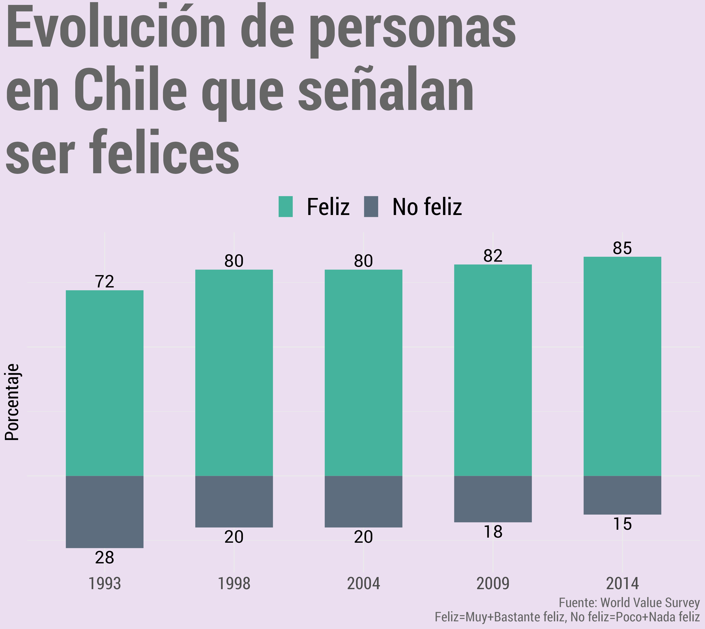
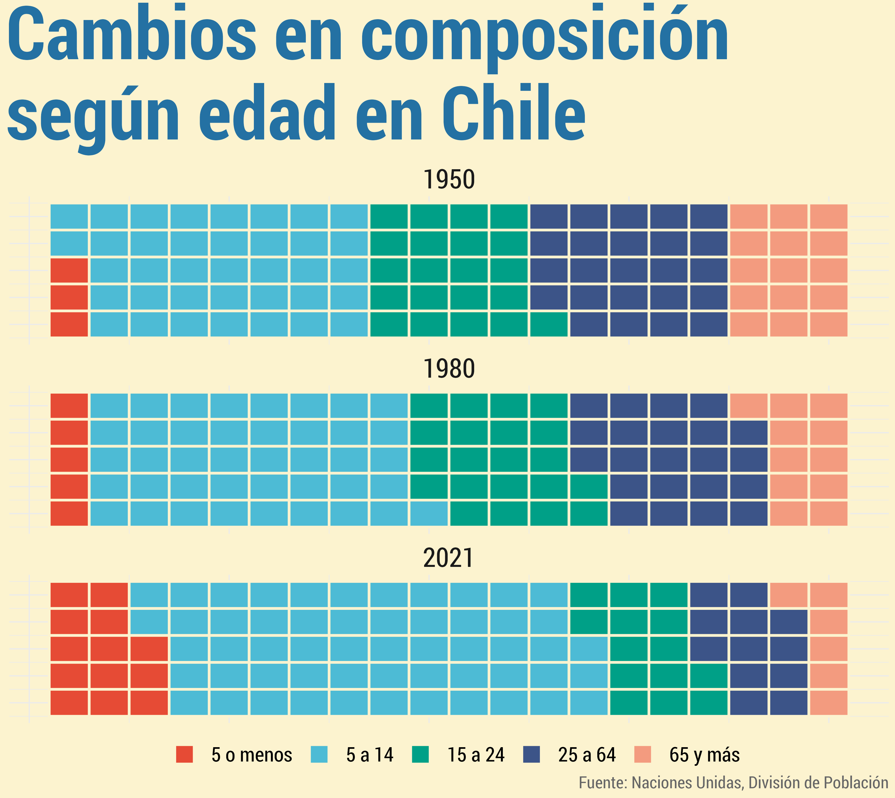
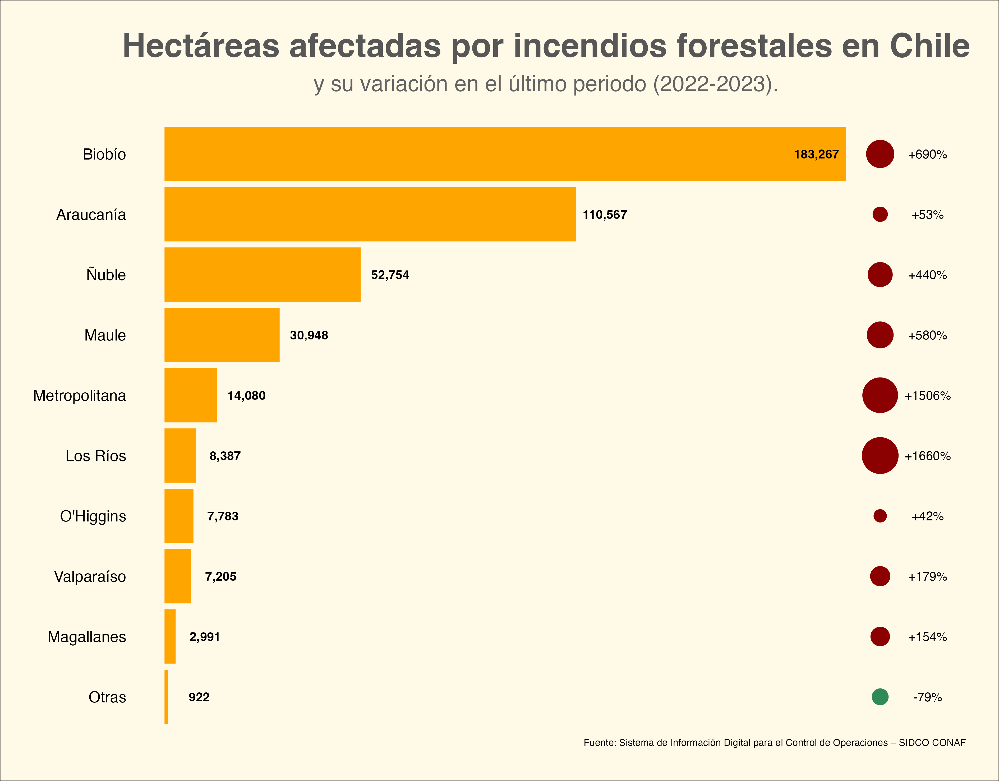
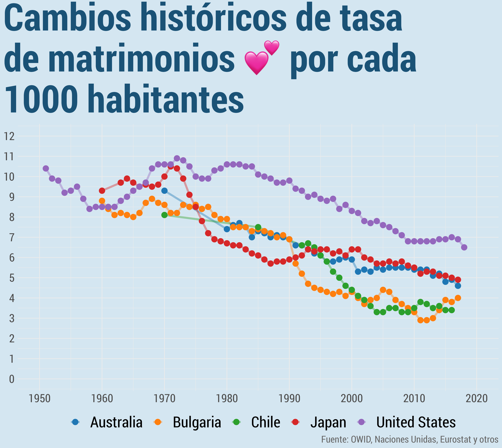
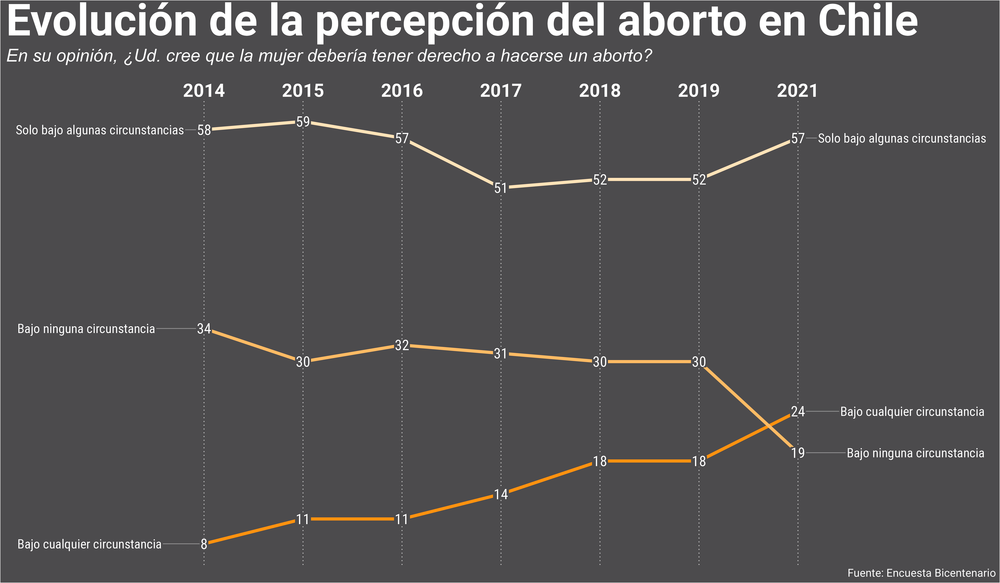
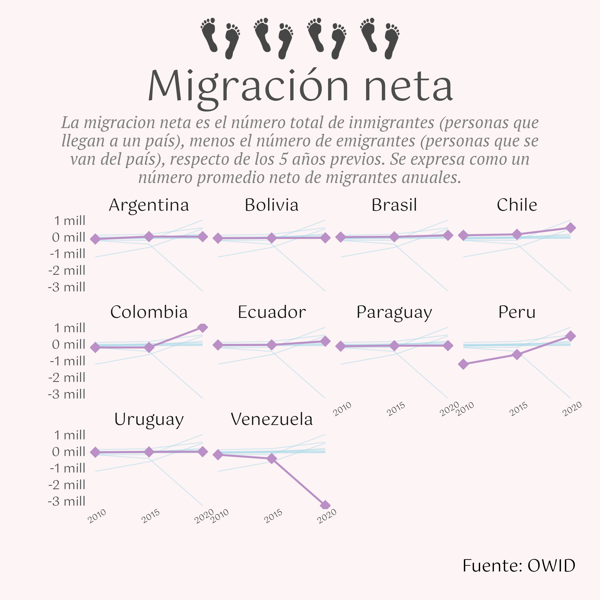
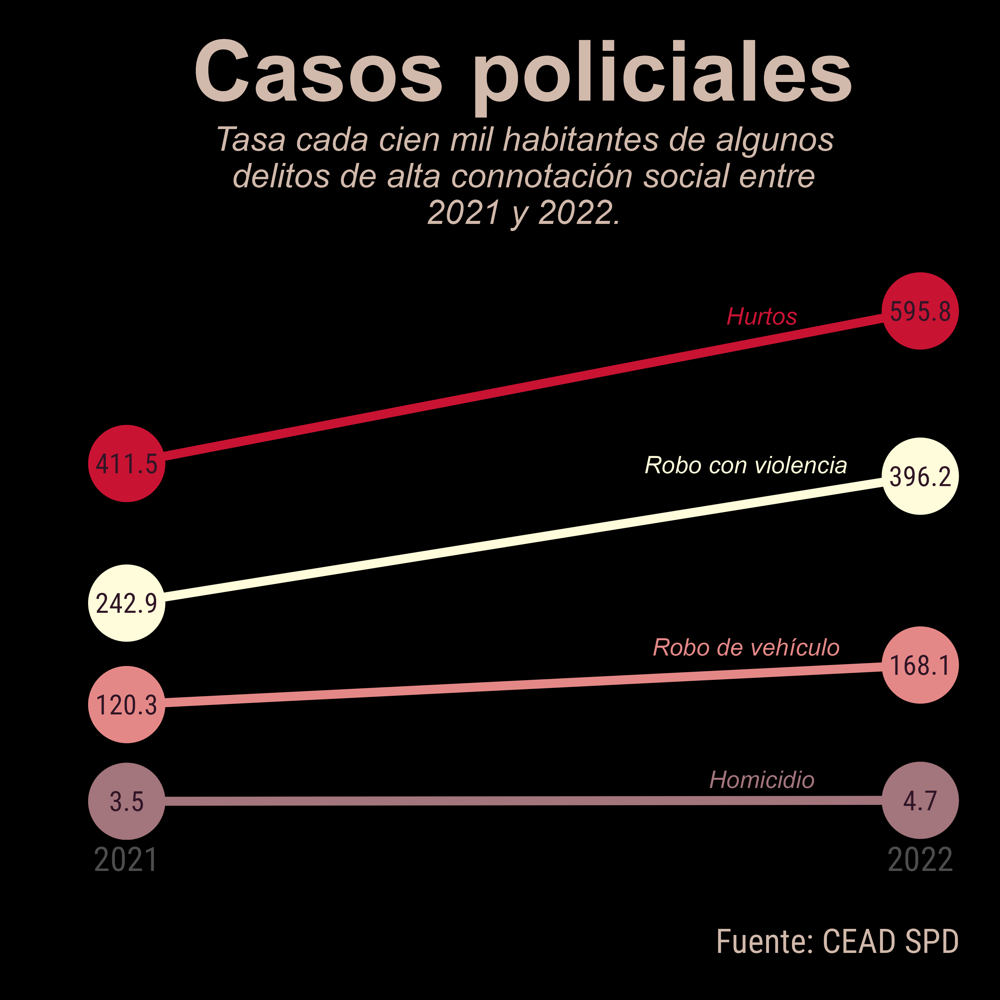
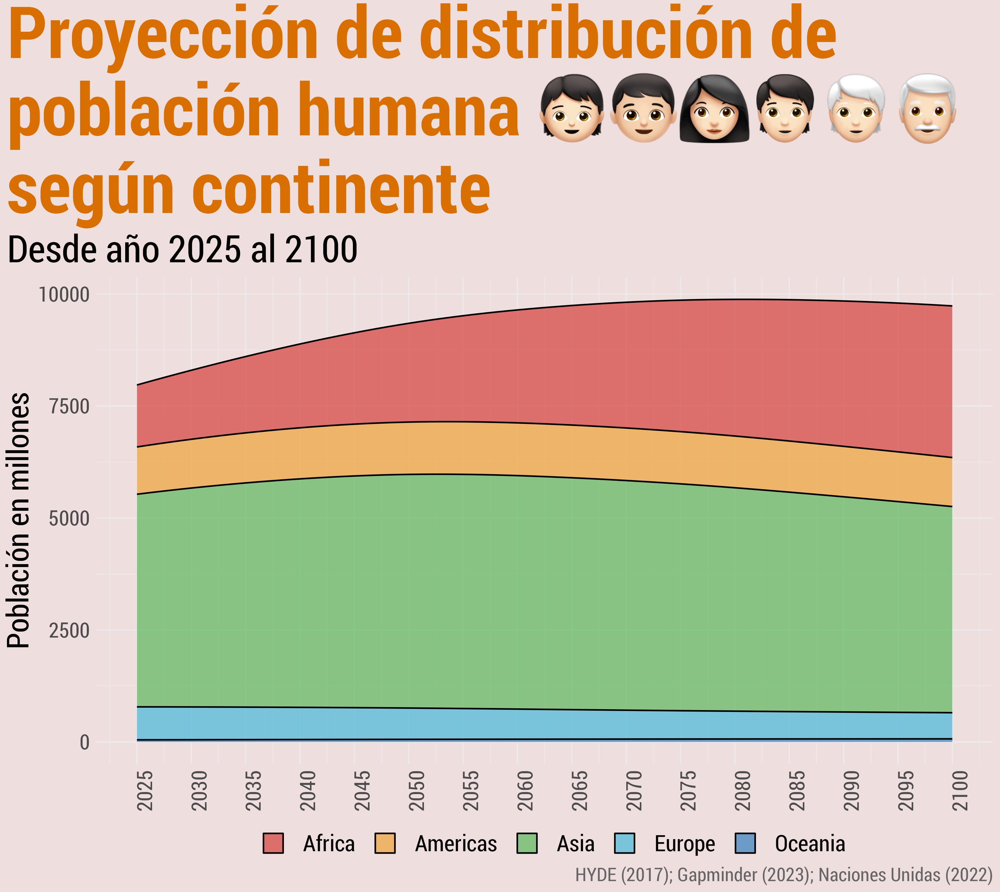
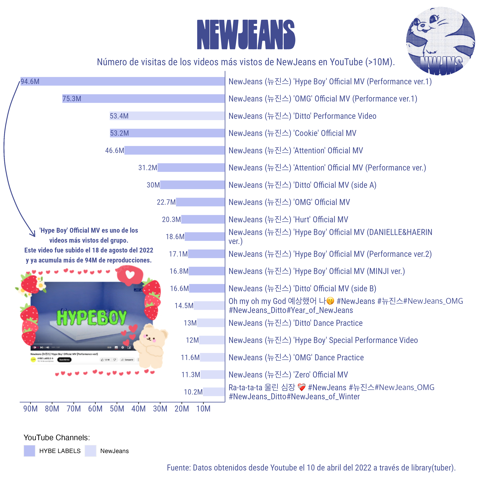
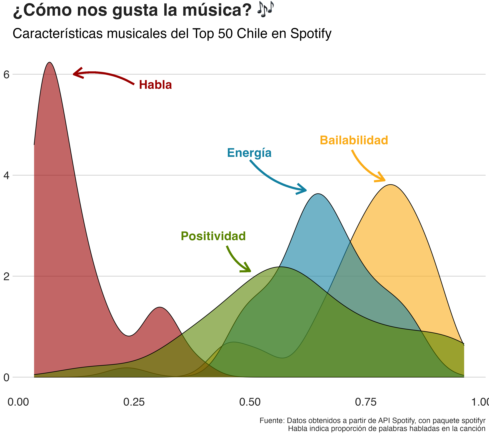

# 30DayChartChallenge2023

Participación en #30DayChartChallenge 2023 (ver: https://twitter.com/30DayChartChall).

- En la carpeta "R" encuentras los script de los gráficos subidos según día.

- En la carpeta "input" puedes encontrar las bases de datos, a menos que éstas sean públicas. De ser así en el script encontrarás un link a ellas.

- En la carpeta "output" encuentras las imágenes de los gráficos.

Equipo [DESUC](http://sociologia.uc.cl/desuc/quienes-somos-desuc/)

Nuestro blog [aquí](https://blog.desuc.cl/) y lo que hacemos [aquí](https://blog.desuc.cl/incidencia.html)

### Día 1: Part-to-whole 

Este tipo de gráficos que se engloban en los "part-to-whole" permiten mostrar partes dentro de una variable. Aquí quisimos mostrar datos de felicidad para Chile desde World Values Survey.

- Datos para la elaboración del gráfico disponibles [aquí](https://ourworldindata.org/happiness-and-life-satisfaction)
- Código disponible [aquí](/R/01-part-to-whole.R)

Autoría Cristina Marchant.

### Día 2: waffle 

Este tipo de gráficos permiten mostrar mediante un pictograma la distribución de ciertos datos. Aquí quisimos mostrar información respecto del envejecimiento poblacional en Chile.

- Datos para la elaboración del gráfico disponibles [aquí](https://ourworldindata.org/age-structure)
- Código disponible [aquí](/R/02-waffle.R)

Autoría Cristina Marchant.

### Día 3: Fauna/flora

En este gráfico se utilizaron datos del Sistema de Información Digital para el Control de Operaciones de CONAF, con el fin de observar las hectáreas afectadas por incendios forestales en Chile.

- Datos para la elaboración del gráfico disponibles [aquí](/input/incendios_forestales_2023.csv)
- Código disponible [aquí](/R/03-flora_fauna.R)

Autoría Josefa Guerra.

### Día 4: Historical 

Este tipo de gráficos permiten mostrar datos de secuencias históricas. Seguimos en la demografía mostrando datos respecto a la caída de matrimonios en Chile en comparación con otros países a lo largo del tiempo.

- Datos para la elaboración del gráfico disponibles [aquí](https://ourworldindata.org/marriages-and-divorces)
- Código disponible [aquí](/R/04-historical.R)

Autoría Cristina Marchant.

### Día 5: Slopes 

Este tipo de gráficos permiten mostrar variaciones a través de los años. El día de hoy nos centramos en el cambio que ha tenido la percepción del aborto en Chile en los últimos ocho años.

- Datos para la elaboración del gráfico disponibles [aquí](/input/Datos_aborto_bicentenario.xlsx)
- Código disponible [aquí](/R/05-slopes.R)

Autoría Jonatan Salazar.

### Día 6: Data day OWID 

Este día era el último de la serie de "distributions", y correspondía a un gráfico con datos de Our World in Data [OWID](https://ourworldindata.org/)  

- Datos para la elaboración del gráfico disponibles [aquí](https://ourworldindata.org/migration)
- Código disponible [aquí](/R/06-data-day-OWID.R)

Autoría Vicky Rojas.

### Día 7: Hazards 

Hoy empezaban los gráficos de distribuciones, sin embargo, nos quedamos atrás. Pero tomamos en consideración la idea de "riesgos", para graficar los casos policiales entre 2021 y 2022. 

- Datos para la elaboración del gráfico disponibles [aquí](http://cead.spd.gov.cl/wp-content/uploads/file-manager/Presentaci%C3%B3n-Estad%C3%ADsticas-anual-2022.pdf)
- Código disponible [aquí](/R/07-hazards.R)

Autoría Vicky Rojas.

### Día 8: Humans

Hoy continuamos con el tema "humanos" y el tipo de gráfico de distribuciones.  

- Datos para la elaboración del gráfico disponibles [aquí](https://ourworldindata.org/future-population-growth)
- Código disponible [aquí](/R/08-humans.R)

Autoría Cristina Marchant.

### Día 10: Híbrido

Este gráfico utiliza la librería `tuber` que nos permite descargar la información de canales y playlist de YouTube. Con esta información, construímos un gráfico que muestra el número de visitas/reproducciones que hay en el canal de NewJeans y los videos de **NewJeans** en el canal de HYBE LABELS. Dejando aquellos videos con más de 10M de reproducciones, es posible observar los videos más visitados de este nuevo grupo de kpop. El concepto híbrido se pensó en la combinación de `ggplot2` e imágenes en png.

- Código disponible [aquí](/R/10-híbrido.R)

Autoría Soledad Araya.

### Día 12: Theme day: BBC News

Para este día se trabajó con datos obtenidos a partir del trabajo con el paquete spotifyr. Acá pueden encontrar un tutorial: https://www.rcharlie.com/spotifyr/

- Código disponible [aquí](/R/12-bbc_news.R)

Autoría Cristina Marchant.

